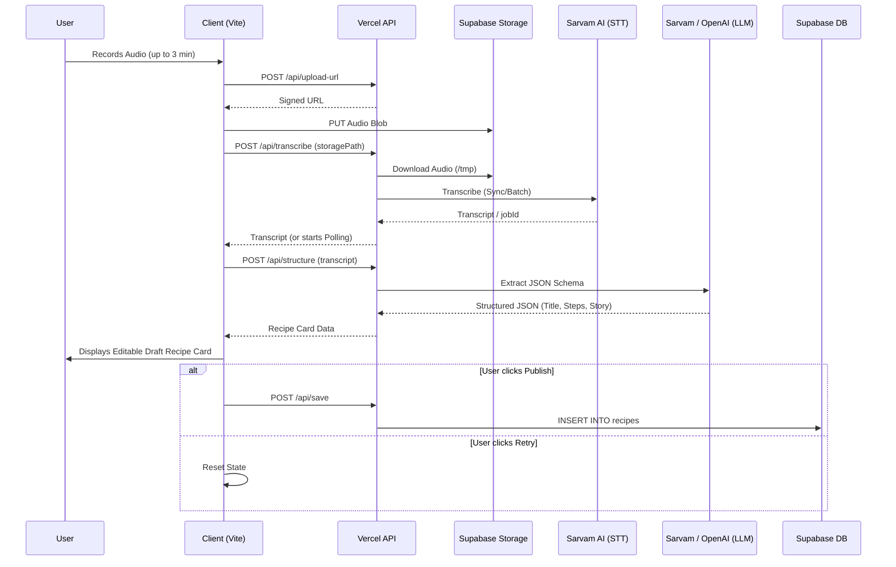

# TalknTaste - System Design & Implementation Guide

## 1. Overview
TalknTaste is a voice-first web application that allows users to speak a recipe in any Indian language and instantly get a structured, shareable recipe card. It relies on advanced Speech-to-Text (STT), Large Language Models (LLMs), and a robust Serverless architecture.

## 2. Tech Stack & Architecture

### Frontend (Client)
- **HTML/CSS/Vanilla JS**: A lightweight, dependency-free UI.
- **Vite**: Fast local development server and bundler.
- **Vibrant Design System**: A modern, block-based UI utilizing warm terracotta and fresh green aesthetics.
- **Bottom Navigation**: Intuitive mobile-first tabs separating the "Record" flow from the "Library".
- **MediaRecorder API**: For capturing microphone input.

### Backend (Serverless API)
- **Vercel Serverless Functions (`api/`)**: Scalable, zero-maintenance backend endpoints.
- **Node.js**: Execution runtime.

### Data & AI (Third-Party)
- **Supabase PostgreSQL**: Relational data store for the recipe library.
- **Supabase Storage**: Blob storage for persisting raw audio recordings (configured as Public bucket for playback).
- **Sarvam AI (Saaras v3)**: STT engine highly specialized for Indian language accuracy.
- **Sarvam AI (sarvam-105b)**: Flagship LLM used to accurately map raw, conversational transcripts into standard JSON recipe objects while preserving regional languages perfectly.
- **OpenAI (GPT-4o-mini)**: Serves strictly as a safety fallback in case the primary Sarvam LLM encounters an issue.

---

## 3. Architecture Decisions & Explanations

1. **Direct Uploads to Supabase**: Vercel Serverless Functions have a strict 4.5MB payload limit for incoming requests. A 3-minute audio recording easily exceeds this. To solve this, the client requests a signed URL (`/api/upload-url`) and uploads the audio directly to Supabase Storage.
2. **Polling for Batch Transcription**: Sarvam AI offers a Batch API for longer audio files. Vercel functions time out after 10–60 seconds, which isn't enough to wait for a 3-minute transcription. We return a `jobId` and use client-side polling (`/api/poll`) to circumvent serverless timeouts.
3. **Streamlined Pipeline**: Previously, the app paused after transcription to ask the user to "Review" the text. This friction was removed. The app now immediately pipes the STT output into the LLM structuring engine. Users can simply "Retry" from the final drafted recipe card if the output is inaccurate.
4. **LLM Fallback Mechanism**: Sarvam's `105b` model is our primary structurer because it preserves Indian code-mixing natively. However, LLMs can occasionally return malformed JSON. The backend catches JSON parse errors and automatically falls back to OpenAI (`gpt-4o-mini`) to ensure the user always gets a valid recipe card.
5. **Context Extraction**: The LLM prompt is explicitly designed to extract "additional info" (personal stories, cultural relevance, etc.) from the transcript, preventing non-instructional banter from cluttering the recipe steps while preserving the user's personal touch.

---

## 4. End-to-End Logic Flow

### Phase 1: Audio Capture & Upload
1. User taps the mic on the Record tab.
2. `client/js/recorder.js` captures chunks of audio via MediaRecorder up to a 3-minute limit.
3. **Signed URL generation**: `POST /api/upload-url` returns a secure Supabase URL.
4. **Direct Upload**: The client directly uploads the audio `Blob` to Supabase Storage. (This circumvents Vercel's 4.5MB payload limitations).

### Phase 2: Processing & Transcription
1. Client hits `POST /api/process` with the uploaded file's Supabase storage path.
2. The serverless function downloads the audio to the ephemeral `/tmp` directory.
3. Audio is evaluated for length:
   - **Sync Flow (<= 30s)**: Sent directly to Sarvam AI. Returns transcript immediately.
   - **Batch Flow (> 30s)**: Sent to Sarvam AI batch processing. Returns a `jobId` and `202 Accepted` to the client.
4. **Polling**: If batched, the client loops `POST /api/poll` until the transcript is ready, ensuring long processes do not trigger Vercel timeout limits.

### Phase 3: Immediate Structuring
1. **Direct Transition**: Once the transcript is received via polling or sync, the client immediately sends it to `POST /api/structure`.
2. `api/_lib/sarvam-llm.js` calls Sarvam's `105b` model. The prompt enforces:
   - **Original Language Preservation**: JSON outputs must match the input language (e.g., Kannada audio yields Kannada text).
   - **Context Extraction**: Stories and relevance are extracted into `additionalInfo`.
   - Inference of missing metadata (prep times, servings).
   - Segregation of ingredients (with quantities) from actionable steps.
3. **Fallback**: If Sarvam returns invalid JSON, it falls back to `api/_lib/openai.js` (GPT-4o-mini) automatically.

### Phase 4: Database & Presentation
1. Client sends a fire-and-forget `POST /api/save` with the structured recipe.
2. `api/_lib/supabase.js` auto-generates tags and persists the record to PostgreSQL (including the `additional_info` field).
3. The UI presents the recipe on a Vibrant block card. Users can edit text inline, view their personal story/context, or easily share to WhatsApp and Twitter.

---

## 5. API Endpoints

- **`POST /api/upload-url`**: Generates a signed Supabase Storage URL.
- **`POST /api/process`**: Downloads audio, initiates Sarvam transcription, handles Sync vs Batch routing.
- **`POST /api/poll`**: Checks Sarvam job status and fetches completed transcripts.
- **`POST /api/structure`**: Maps transcript to JSON via Sarvam LLM (with OpenAI fallback).
- **`POST /api/save`**: Saves to Supabase PostgreSQL.
- **`POST /api/update`**: Updates an existing recipe record (title, prep time, servings, ingredients, steps, tags) in Supabase PostgreSQL.
- **`GET /api/recipes`**: Retrieves the user's saved recipes for the Library tab.

